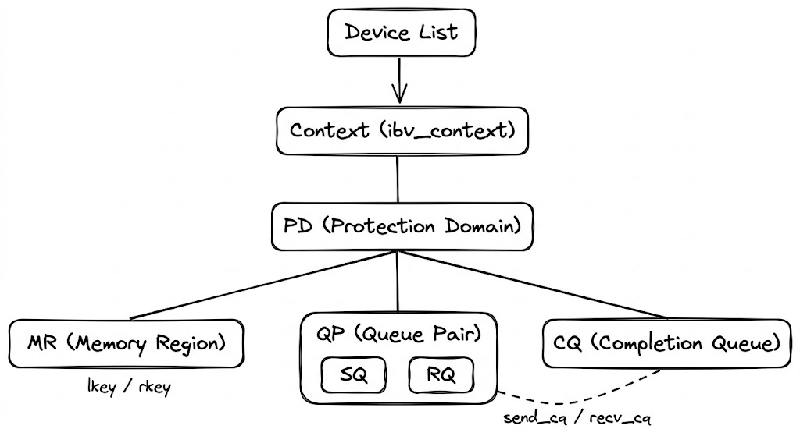
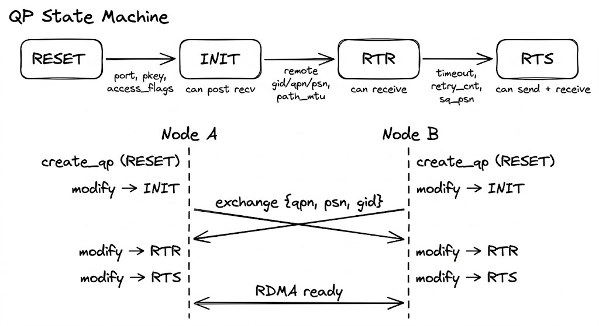

I'm building a distributed P2P sharing feature for [Pegaflow](https://github.com/novitalabs/pegaflow), where different instances need to transfer data over RDMA. I don't have much RDMA experience myself, and I've found that zero-to-one RDMA tutorials are surprisingly scarce online, so this post is my attempt to document the learning process.

The draft was written by me and polished with Opus; the diagrams were generated by Nano Banana Pro. As an RDMA newcomer, there may still be inaccuracies — feedback is welcome.

> **Code**: https://github.com/novitalabs/pegaflow
> (The RDMA parts are still evolving. For production-quality references, check out [Mooncake](https://github.com/kvcache-ai/Mooncake), [pplx-garden](https://github.com/perplexityai/pplx-garden), and [Sideway](https://github.com/RDMA-Rust/sideway) — all written by experienced RDMA practitioners.)

---

## 1. What is RDMA

RDMA stands for Remote Direct Memory Access. It enables two machines to perform direct memory-to-memory transfers without involving the OS or CPU; the entire flow is handled by the NIC, achieving zero-copy, full bypass, and offloading the protocol to the card.

RDMA is a capability, or more precisely a semantic. There are several concrete implementations today:
1. InfiniBand: a full-stack proprietary link layer + network layer + transport layer
2. RoCEv2 (the dominant option in data centers): the RDMA transport layer runs on UDP/IP + Ethernet
3. AWS EFA, Google Falcon, Alibaba erdma, which are broadly compatible with minor differences; they are not needed for this post, so we can ignore them

libibverbs is the user-space core library for RDMA programming; it exposes a unified C API (called the verbs API) so applications can control RDMA hardware without caring whether the underlying fabric is InfiniBand, RoCE, or iWARP.

The overall stack looks roughly like this
```
┌─────────────────────────────┐
│  Application (e.g., NCCL, SPDK) │
├─────────────────────────────┤
│  Higher-level abstraction (libfabric / UCX) │   ← optional; some applications call verbs directly
├─────────────────────────────┤
│  libibverbs                 │   ← user-space core library defining verbs API
├─────────────────────────────┤
│  Provider driver plugin       │   ← e.g., libmlx5 (Mellanox/NVIDIA)
│  (user-space driver)         │     loaded through libibverbs’ provider mechanism
├─────────────────────────────┤
│  Kernel driver (mlx5_ib, etc.)      │   ← only handles the minimum control-plane work: connection setup, memory registration, etc.
├─────────────────────────────┤
│  RDMA NIC hardware           │
└─────────────────────────────┘
```

All the RDMA programming introduced later is based on libibverbs.
## 2. The Complete Flow of an RDMA Transfer

The overall flow can be likened to reading or writing a file
1. Identify available disks and list their files
2. Open the file and obtain a handle (i.e., a file descriptor)
3. Based on that descriptor, allocate a buffer if you want to read, then call `read`
4. Close the handle when done

See the big picture first, then dive into each step.

```
┌─────────────────────────────────────────────────────────────────┐
│ 1. Discover devices    ibv_get_device_list → ibv_open_device → Context  │
│ 2. Allocate resources  Context → PD → { MR, QP, CQ }                   │
│ 3. Establish connection  Exchange addressing info → QP state machine INIT → RTR → RTS         │
│ 4. Transfer data    post RDMA_WRITE / RDMA_READ → poll CQ            │
│ 5. Clean up        deregister MR → destroy QP/CQ → dealloc PD       │
└─────────────────────────────────────────────────────────────────┘
```

The corresponding code looks roughly like this (pseudocode with error handling omitted):
```c
// 1. Discover devices
struct ibv_device **dev_list = ibv_get_device_list(NULL);
struct ibv_context *ctx = ibv_open_device(dev_list[0]);

// 2. Allocate resources
struct ibv_pd *pd = ibv_alloc_pd(ctx);
struct ibv_cq *cq = ibv_create_cq(ctx, 16, NULL, NULL, 0);

struct ibv_qp_init_attr qp_attr = {
    .send_cq = cq,  .recv_cq = cq,
    .qp_type = IBV_QPT_RC,
    .cap = { .max_send_wr = 16, .max_recv_wr = 16,
             .max_send_sge = 1, .max_recv_sge = 1 },
};
struct ibv_qp *qp = ibv_create_qp(pd, &qp_attr);

void *buf = malloc(4096);
struct ibv_mr *mr = ibv_reg_mr(pd, buf, 4096,
    IBV_ACCESS_LOCAL_WRITE | IBV_ACCESS_REMOTE_WRITE | IBV_ACCESS_REMOTE_READ);

// 3. Establish the connection (exchange gid/lid/qpn/psn through an out-of-band channel, then drive the QP state machine)
//    modify_qp: RESET → INIT → RTR → RTS  (see Section 6 for details)

// 4. Transfer data — using RDMA_WRITE as an example
struct ibv_sge sge = { .addr = (uint64_t)buf, .length = 4096, .lkey = mr->lkey };
struct ibv_send_wr wr = {
    .opcode     = IBV_WR_RDMA_WRITE,
    .send_flags = IBV_SEND_SIGNALED,
    .sg_list    = &sge,
    .num_sge    = 1,
    .wr.rdma    = { .remote_addr = remote_addr, .rkey = remote_rkey },
};
struct ibv_send_wr *bad_wr;
ibv_post_send(qp, &wr, &bad_wr);

// poll for completion
struct ibv_wc wc;
while (ibv_poll_cq(cq, 1, &wc) == 0) ;  // wait for completion
assert(wc.status == IBV_WC_SUCCESS);

// 5. Clean up
ibv_dereg_mr(mr);
ibv_destroy_qp(qp);
ibv_destroy_cq(cq);
ibv_dealloc_pd(pd);
ibv_close_device(ctx);
```
## 3. Resource hierarchy: from device to queue


```
ibv_get_device_list
 └─ ibv_open_device → Context
     └─ alloc_pd → PD (Protection Domain, a namespace for resource isolation)
         ├─ reg_mr → MR (Memory Region, registers memory so the NIC can DMA it directly)
         ├─ create_cq → CQ (Completion Queue, where the NIC writes completion/failure events)
         └─ create_qp → QP (Queue Pair, requires a CQ to be created first)
```

### 3.1 Protection Domain (PD)

A **Protection Domain** binds QPs, MRs (Memory Regions), and MWs (Memory Windows) together. Only resources within the same PD can work together, providing isolation and safety.

It behaves like a namespace in multi-tenant isolation. The PD must stay alive while its Context is active. PD has a very simple job: it exists only for two purposes:

1. Registering memory
2. Creating QPs

It has no other function.

### 3.2 Memory Region (MR)

RDMA’s core capability is letting the remote side directly read or write our memory without CPU involvement. That does not mean the remote peer can access arbitrary memory immediately when the NIC is plugged in — the application must explicitly register a memory range and declare “this memory is accessible by the NIC.” The object returned by registration is the Memory Region (MR).

Registration performs two actions:

1. **Establish address translation**: processes use virtual addresses while NIC DMA needs physical addresses. During registration, the kernel walks the page tables and writes the virtual-to-physical mappings into the NIC’s hardware page tables (the Memory Translation Table, MTT). Afterwards, when the NIC sees a virtual address, it can walk its own table to find the physical address without CPU intervention.

2. **Pin the pages**: the OS could otherwise swap the pages out or replace their physical backing during a fork/COW. If the NIC kept using the old physical addresses, it would DMA into the wrong memory. Registration pins the pages so their physical addresses remain stable.

The registration API:

```c
// libibverbs/include/infiniband/verbs.h:1301
struct ibv_mr *ibv_reg_mr(struct ibv_pd *pd, void *addr, size_t length, int access);
```

Parameters:
- `pd`: the Protection Domain; the MR can only be used by QPs in the same PD
- `addr` + `length`: the virtual address range to register
- `access`: a bitmask that controls what this memory is **allowed to do**. For example, if only remote reads are needed, set `REMOTE_READ`; if remote writes are also required, add `REMOTE_WRITE`. The NIC hardware rejects permissions that were not granted. See the access flags section below.

The call returns an `ibv_mr`:

```c
// libibverbs/include/infiniband/verbs.h:448
struct ibv_mr {
    struct ibv_context     *context;
    struct ibv_pd          *pd;
    void                   *addr;     // registered virtual address
    size_t                  length;
    uint32_t                handle;   // kernel-side handle
    uint32_t                lkey;     // Local Key
    uint32_t                rkey;     // Remote Key
};
```

The two essential outputs are the **lkey** and **rkey**. Think of them as hotel keycards: you (the MR owner) ask the front desk (the NIC) to make a keycard (rkey) and hand it to the guest (the remote peer). The guest swipes the card to enter your room; without the card, the door stays locked. You can also choose to issue a read-only card (`REMOTE_READ`) or a card that supports both read and write (`REMOTE_READ | REMOTE_WRITE`).

- **lkey**: used in `ibv_sge.lkey` when posting WRs; the local NIC uses it to look up entries in the MTT and verify permissions.
- **rkey**: shared out-of-band (via SEND/RECV, TCP, etc.) with the remote side. The remote peer fills it into `wr.rdma.rkey` when it issues `RDMA_WRITE` / `RDMA_READ`; the remote NIC uses it to validate authorizations and walk its MTT.

```
Local post of RDMA_WRITE:
  sge.addr   = local_buf         ← where the data is read from
  sge.lkey   = local_mr->lkey    ← local NIC uses this to look up the local MTT
  wr.remote_addr = remote_buf    ← the destination on the remote side
  wr.rkey    = remote_mr->rkey   ← remote NIC uses this to validate and locate the remote MR
```

#### Access flags

```c
// libibverbs/include/infiniband/verbs.h:402
enum ibv_access_flags {
    IBV_ACCESS_LOCAL_WRITE   = 1,       // local NIC may write (needed for RECV buffers or local RDMA_READ targets)
    IBV_ACCESS_REMOTE_WRITE  = (1<<1),  // allow remote RDMA_WRITE
    IBV_ACCESS_REMOTE_READ   = (1<<2),  // allow remote RDMA_READ
    IBV_ACCESS_REMOTE_ATOMIC = (1<<3),  // allow remote atomic operations
    IBV_ACCESS_ON_DEMAND     = (1<<6),  // ODP on-demand paging, no pinning (special usage)
};
```

Hardware rule: **REMOTE_WRITE must be paired with LOCAL_WRITE**. Remote writes are ultimately DMA writes performed by the local NIC. Without LOCAL_WRITE, the NIC rejects the request. Local read is always enabled by default and does not need to be set explicitly.

#### Registration costs

Registration is not free:
- `ibv_reg_mr` traverses page tables and calls `get_user_pages`, so it goes through the syscall path. On a CX7 NIC, registering a buffer is around 40GB/s (after the pages are faulted in—pure registration overhead). In other words, registering a 40GB buffer takes about 1 second per NIC, or 8 seconds if you register it on eight NICs.
- Pinned pages cannot be swapped or migrated between NUMA nodes, reducing available system memory.
- Each MR consumes entries in the NIC’s MTT; `device_attr.max_mr` limits how many you can have.

For these reasons, practice is to **register large buffers in advance and reuse them**, rather than registering/deregistering for each transfer. Huge pages also reduce registration overhead by decreasing the number of pages in the page table.

#### Deregistration

```c
int ibv_dereg_mr(struct ibv_mr *mr);
```

This unpins the pages and frees the NIC’s MTT entries. Ensure no in-flight WRs still reference this MR when you deregister it.

---

Once the MR has prepared memory, the next step is to have a place to submit transfer requests. The RDMA interface model is almost identical to io_uring: the application submits requests into a submission queue (SQ), and the hardware writes completion notifications into a completion queue (CQ). Both follow the proactor pattern.

Contrast this with epoll’s reactor pattern: epoll merely notifies that an FD is ready to read, and the application still needs to call `read()` to move data itself; the I/O is not yet done. Proactor notifies that the I/O has already completed and the data is already in the buffer. Think of reactor as a locker notification that a package arrived and you need to go pick it up, while proactor is a home delivery with a signature confirmation.

### 3.3 Completion Queue (CQ)

The hardware writes WR completion/failure results (CQEs, Completion Queue Entries) here, and software retrieves them with `poll_cq()`.

CQs are standalone resources and do not belong to any individual QP. When you create a QP, you associate it with a CQ via the `send_cq`/`recv_cq` fields. Multiple QPs can point to the **same CQ**—one CQ can receive completion events for all of them, so one poll can fetch results from multiple QPs. This is different from SRQ: CQ sharing is about **completion notifications**, while SRQ sharing is about **receive buffer pools**; the two are independent.

Compare to io_uring: io_uring ties one SQ+CQ pair together per ring and does not allow a CQ to be shared across rings. RDMA is more flexible because CQ and QP have a many-to-many relationship.

#### Creating a CQ

```c
// libibverbs/include/infiniband/verbs.h:1397
struct ibv_cq *ibv_create_cq(struct ibv_context *context, int cqe,
    void *cq_context,
    struct ibv_comp_channel *channel,
    int comp_vector);
```

Parameters:
- `context`: the device context
- `cqe`: the minimum number of CQEs the CQ can hold. The actual allocation may be larger (hardware often rounds up to a power of two).
- `cq_context`: a user pointer that is passed back in callbacks; it is purely opaque.
- `channel`: a completion channel used for event-driven mode (`ibv_get_cq_event`). Pass NULL for pure polling.
- `comp_vector`: the completion vector that routes interrupts to a CPU, in the range `[0, context->num_comp_vectors)`. For pure polling, pass 0.

The returned `ibv_cq`:

```c
// verbs.h:863
struct ibv_cq {
    struct ibv_context *context;
    struct ibv_comp_channel *channel;
    void *cq_context;
    uint32_t handle;
    int cqe; // actual CQ capacity (≥ requested value)
    // ... internal synchronization fields omitted
};
```

#### Polling completions

```c
// verbs.h:1443
static inline int ibv_poll_cq(struct ibv_cq *cq, int num_entries, struct ibv_wc *wc);
```

You pass an array of `ibv_wc` and the return value ≥ 0 indicates how many CQEs were retrieved; < 0 indicates an error. A return smaller than `num_entries` means the CQ is empty. Typical usage is a busy-poll loop:

```c
struct ibv_wc wc;
while (ibv_poll_cq(cq, 1, &wc) == 0) ; // wait for a completion
```

Each CQE is an `ibv_wc` (Work Completion):

```c
// verbs.h:383
struct ibv_wc {
    uint64_t wr_id;          // User ID set when posting the WR, links the completion to the request
    enum ibv_wc_status status; // Completion status: SUCCESS or various errors
    enum ibv_wc_opcode opcode; // The operation type that completed
    uint32_t vendor_err;     // Vendor-specific error code
    uint32_t byte_len;       // Actual bytes transferred (meaningful for RECV / RDMA_READ)
    uint32_t imm_data;       // Immediate value carried by SEND_WITH_IMM / WRITE_WITH_IMM
    uint32_t qp_num;         // QP number that generated this completion (needed when multiple QPs share a CQ)
    uint32_t src_qp;         // Remote QP number (meaningful in UD)
    int wc_flags;            // Flags (e.g., presence of imm_data)
    uint16_t pkey_index;
    uint16_t slid;           // Remote LID (InfiniBand)
    uint8_t sl;
    uint8_t dlid_path_bits;
};
```

**Common values for `status`** (only the ones you typically see):

| status                     | Meaning                                                     |
| -------------------------- | ---------------------------------------------------------- |
| `IBV_WC_SUCCESS`           | Success                                                      |
| `IBV_WC_WR_FLUSH_ERR`      | When a QP transitions to Error state, all pending WRs are flushed with this error. It’s the most common “bulk failure.” |
| `IBV_WC_RETRY_EXC_ERR`     | Retry count exhausted. Usually indicates the peer crashed or the network is disconnected. |
| `IBV_WC_RNR_RETRY_EXC_ERR` | Remote receive queue stayed empty and the RNR retry limit was reached. The remote side has not posted receives. |
| `IBV_WC_REM_ACCESS_ERR`    | Remote access permission error. Either the rkey is wrong, MR permissions are insufficient, or the address was out of bounds. |
| `IBV_WC_LOC_LEN_ERR`       | Local length error. The RECV buffer is smaller than the incoming message. |
| `IBV_WC_LOC_PROT_ERR`      | Local protection error. The lkey is wrong, or the MR and QP are not in the same PD. |

**`opcode`** (the operation type that completed):

```c
enum ibv_wc_opcode {
    IBV_WC_SEND,
    IBV_WC_RDMA_WRITE,
    IBV_WC_RDMA_READ,
    IBV_WC_COMP_SWAP,
    IBV_WC_FETCH_ADD,
    IBV_WC_BIND_MW,
    IBV_WC_LOCAL_INV,
    IBV_WC_RECV = 1 << 7,      // receive completion; you can check `(opcode & IBV_WC_RECV)` to see if it’s a receive
    IBV_WC_RECV_RDMA_WITH_IMM,  // Received RDMA_WRITE_WITH_IMM
};
```

#### Two CQ APIs

1. **BasicCompletionQueue**: pass an array to `ibv_poll_cq` and let the kernel fill it.
2. **ExtendedCompletionQueue**: `ibv_start_poll` → `ibv_next_poll` → `ibv_end_poll`, with support for hardware timestamps.

Most projects still use the first API. The advantage of the extended API is that the NIC can write hardware timestamps into the completions, which is useful for high-precision latency monitoring.

#### Destroying a CQ

```c
int ibv_destroy_cq(struct ibv_cq *cq);
```

Ensure no QP still references this CQ. The destruction order should be: destroy QPs first, then destroy CQs.

CQ size must be controlled because it consumes NIC memory.

### 3.4 Queue Pair (QP)

> The QP is the central resource in RDMA programming — PD and MR are setup work, CQ is for receiving results, and all transfer submissions and executions orbit around the QP.

A **QP = Queue Pair** is fundamentally two hardware queues:

- **SQ (Send Queue)** — submits send-type WRs (SEND / RDMA_WRITE / RDMA_READ).
- **RQ (Receive Queue)** — pre-posted RECV WRs that provide receive buffers for SEND/RECV operations.

The QP primarily manages sending. For RDMA_WRITE / RDMA_READ, only the initiator’s SQ is involved; the remote QP does not participate (the remote NIC directly reads/writes the MR). The RQ is consumed only in SEND/RECV semantics.

When creating a QP, you pass the pre-created CQs:

```c
// libibverbs/include/infiniband/verbs.h:1568
struct ibv_qp *ibv_create_qp(struct ibv_pd *pd, struct ibv_qp_init_attr *qp_init_attr);
```

The creation parameters are specified in `ibv_qp_init_attr`:

```c
// verbs.h:612
struct ibv_qp_init_attr {
    void               *qp_context;
    struct ibv_cq      *send_cq;    // Completion CQ for the SQ
    struct ibv_cq      *recv_cq;    // Completion CQ for the RQ (can be the same as `send_cq`, and multiple QPs can share a CQ)
    struct ibv_srq     *srq;        // Shared Receive Queue; multiple QPs can share the same receive buffer pool. Pass NULL if unused.
    struct ibv_qp_cap   cap;        // Capacity limits
    enum ibv_qp_type    qp_type;    // RC / UD / ...
    int                 sq_sig_all; // Whether every SQ WR should produce a CQE
};
```

`ibv_qp_cap` controls queue depths:

```c
// verbs.h:604
struct ibv_qp_cap {
    uint32_t max_send_wr;     // Maximum number of WRs in the SQ
    uint32_t max_recv_wr;     // Maximum number of WRs in the RQ
    uint32_t max_send_sge;    // Maximum scatter/gather entries per send WR
    uint32_t max_recv_sge;    // Maximum scatter/gather entries per recv WR
    uint32_t max_inline_data; // Maximum number of bytes that can be inlined within a WR (saves a DMA)
};
```

The created `ibv_qp` structure:

```c
// verbs.h:840
struct ibv_qp {
    struct ibv_context *context;
    struct ibv_pd      *pd;
    struct ibv_cq      *send_cq;
    struct ibv_cq      *recv_cq;
    struct ibv_srq     *srq;
    uint32_t            handle;
    uint32_t            qp_num;     // QPN, the identifier of this QP on the NIC; communicated to the peer when connecting
    enum ibv_qp_state   state;      // RESET → INIT → RTR → RTS
    enum ibv_qp_type    qp_type;    // RC / UD / ...
};
```

`qp_type` determines the communication mode:

```c
// verbs.h:586
enum ibv_qp_type {
    IBV_QPT_RC = 2,    // Reliable Connected — reliable, one-to-one, supports RDMA_WRITE/READ
    IBV_QPT_UC,        // Unreliable Connected — unreliable, one-to-one
    IBV_QPT_UD,        // Unreliable Datagram — unreliable, connectionless, only supports SEND/RECV
    // ...
};
```

> A QP is first and foremost a **local hardware object**; it is not the “connection” itself. A QP can exist without being connected, meaning the QP has been created but not yet bound to a peer. The connection is established later via the QP state machine (INIT → RTR → RTS).

> **Questions to ponder:**
> - What do each of these parameters control? Why not simply set them to extremely large or small values?
> - If 1,000 QPs each maintain their own RQ versus sharing a single SRQ, how different is the memory footprint? When is SRQ worth it, and when is it not?
## 4. QP Types: RC vs UD

By this point, the local PD, MR, QP, and CQ resources have all been created. The next step is to establish a connection with the peer and start moving data. Before connecting, you need to pick the QP type — it dictates the connection model and transfer semantics. The two most common options are RC and UD, and their differences are substantial: one behaves like TCP, the other like UDP.

As with TCP and UDP, most applications still choose RC over UD.

### RC (Reliable Connected)

- **One-to-one connection**: After creating the QP you must populate the peer parameters (remote qpn / psn / lid / gid) and transition the state machine INIT → RTR → RTS. Once connected, the QP is "bound" to that peer — every packet it sends can only reach that single destination.
- **Reliable**: The hardware guarantees retransmit, ordering, and flow control. If a packet is lost the NIC retransmits automatically; if packets arrive out of order the hardware reorders them. The application never needs to handle these issues. That is why it is called "Reliable" — the hardware takes the reliability burden off the software.
- Supports all operation types: SEND/RECV, RDMA_WRITE, RDMA_READ, Atomic.

**Cost**: Each communicating node pair requires a dedicated QP. If there are N nodes in a fully-connected topology, each node must maintain N-1 QPs, and each QP consumes NIC hardware resources (buffers, state tables). Without controlling the NIC connections, the number of QPs can explode quadratically or worse. At large scales (thousands of nodes), RC's scalability becomes a challenge.

### UD (Unreliable Datagram)

- **Connectionless**: Once the QP enters RTS it is usable, and each post_send specifies the destination via an Address Handle. A single UD QP can communicate with any number of endpoints.
- **Unreliable**: Packets may be lost, reordered, or duplicated; the hardware does not guarantee retransmit. Reliability must be implemented by higher layers.
- **Message-oriented**: Each send corresponds to one complete message; there is no automatic fragmentation — **a single message cannot exceed the MTU** (typically 4096 bytes).
- Supports only SEND/RECV; RDMA_WRITE and RDMA_READ are not available.

**Advantage**: One QP can talk to every peer, so N nodes only need one UD QP. UD scales far better than RC.

| | RC | UD |
|---|---|---|
| Connection model | One-to-one, requires connection setup | Connectionless, destination specified via AH |
| Reliability | Guaranteed by hardware | Not guaranteed; higher layer must handle it |
| Operations | SEND/RECV + RDMA_WRITE/READ + Atomic | SEND/RECV only |
| Message size | Unlimited (hardware fragments) | ≤ MTU (~4KB) |
| QPs per N nodes | N-1 | 1 |
| Typical use | Data plane: bulk transfers | Control plane: small message broadcasts |
## 5. Operation Semantics

### RDMA_WRITE

The remote RQ **is not involved**. Simplified model:

1. The local SQ posts an RDMA_WRITE
2. The NIC writes the data directly into the remote MR (`remote_addr` + `rkey`)
3. The local CQ emits a send completion CQE

The remote side will not generate a "receive completion" for this write; the RDMA NIC itself does not raise any such event. The remote side can poll memory to detect completion, which usually requires a flag in the data header or tail — see papers like FaRM for details.

**Exception: RDMA_WRITE_WITH_IMM** — this operation produces a completion event with an immediate value on the remote side, so the remote needs an available RQ WQE to consume that notification.

### RDMA_READ

The remote RQ is also **not involved**, and the remote CPU stays oblivious. Unlike WRITE, READ is a **request-response** operation — the local NIC issues a read request, the remote NIC returns the data, and the overall path is more complex than WRITE. Peak throughput and latency are lower than WRITE; depending on the load, NIC, and configuration, the maximal performance drop is typically under 10%-20% for some workloads.

1. The local SQ posts an RDMA_READ (specifying remote_addr/rkey and local_addr/lkey)
2. The local NIC sends a Read Request to the remote NIC
3. The remote NIC fetches the data from the remote MR and sends back a Read Response
4. The local NIC writes the incoming data to the local buffer via DMA
5. The local CQ produces a completion CQE, which the application retrieves via `poll_cq()`

The remote side still does not generate any CQEs. Key differences versus WRITE:

- **Latency**: WRITE is fire-and-forget; READ must wait for the remote data to arrive.
- **Concurrency limits**: READ is constrained by `max_rd_atomic` / `max_dest_rd_atomic` (the hardware needs to track state for each outstanding READ, typically 16; it has a noticeable impact for small transfers but less so for bulk traffic), while WRITE is unaffected.
- **Traffic direction**: WRITE carries both data and control in the same direction (initiator → remote), whereas READ reverses them (control from initiator → remote, data from remote → initiator).

In practice, READ feels natural when the initiator knows which data it needs (pull model); WRITE is more efficient when the data producer knows where to place the data (push model). For peak performance, prefer WRITE, and when possible keep ownership of issuing transfers with a small set of parties to avoid many-to-one contention.
## 6. Addressing and Connection Setup

To establish an RC connection, both sides need to exchange the following information:

| Concept | Description |
|------|------|
| **GID** | The globally unique address of the HCA, 16 bytes. A single HCA may have multiple GIDs. IB typically uses index 0; RoCE ties each GID to an IP address, so there are as many GIDs as IPs, and you must pick one that routes across the network |
| **LID** | Subnet-local address, 2 bytes, assigned by the switch |
| **QPN** | Queue Pair Number, the identifier of a QP on the HCA, 4 bytes (0 = subnet management, 1 = general services, ≥2 = user) |
| **PSN** | Packet Sequence Number, a 24-bit packet counter maintained per QP to ensure ordering and reliability |

### QP State Machine



An RC QP progresses through four states from creation to usable:

```
ibv_create_qp()          ibv_modify_qp() ×3
      |                        |
   RESET  ──→  INIT  ──→  RTR  ──→  RTS
                 ↑           ↑         ↑
            Local-only config  Remote info  Send-side params
```

Each step advances with `ibv_modify_qp`, passing the target state and the attributes required for that stage. Omitting any mandatory field makes the kernel return `-EINVAL` immediately.

> As an aside: Based on my recent learning, keeping this state machine correct is what allows an RDMA library to reach production maturity. Both sides must stay in sync, handle failovers, and manage errors. In other words, keeping RC connections safe, stable, and maintainable is at the heart of any RDMA stack. Performance-wise you can just fill the queue depth, and today’s LLM KV caches aren’t yet at the microsecond level. When I use Claude Code, I don’t care about adding a few tens of milliseconds to the TTFT. But if RDMA fails, it isn’t just one request’s TTFT; a tightly coupled inference pipeline can snowball, causing major SLO variance. Reliability, observability, and maintainability are what really matter.

`ibv_qp_attr` is a superset of every attribute; only the fields required by the current step are filled, and `attr_mask` tells the kernel which ones are being set:

```c
// verbs.h:701
struct ibv_qp_attr {
    enum ibv_qp_state   qp_state;           // Target state
    enum ibv_mtu        path_mtu;           // Path MTU
    uint32_t            dest_qp_num;        // Remote QP number
    uint32_t            rq_psn;             // Expected starting PSN for RQ
    uint32_t            sq_psn;             // Starting PSN for SQ
    int                 qp_access_flags;    // Remote access permissions
    struct ibv_ah_attr  ah_attr;            // Address vector (how to reach the peer)
    uint16_t            pkey_index;         // P_Key table index
    uint8_t             port_num;           // Physical port
    uint8_t             max_rd_atomic;      // Number of outstanding RDMA Reads this side can issue
    uint8_t             max_dest_rd_atomic; // Number of outstanding RDMA Reads the peer can issue
    uint8_t             min_rnr_timer;      // RNR NAK wait time
    uint8_t             timeout;            // ACK timeout
    uint8_t             retry_cnt;          // Retry count after timeout
    uint8_t             rnr_retry;          // RNR retry count
    // ... other less common fields omitted
};
```

#### RESET → INIT: Local-only configuration

No remote information is needed; only local parameters are initialized:

```c
struct ibv_qp_attr attr = {
    .qp_state        = IBV_QPS_INIT,
    .pkey_index      = 0,
    .port_num        = 1,
    .qp_access_flags = IBV_ACCESS_REMOTE_WRITE | IBV_ACCESS_REMOTE_READ,
};

ibv_modify_qp(qp, &attr,
    IBV_QP_STATE | IBV_QP_PKEY_INDEX | IBV_QP_PORT | IBV_QP_ACCESS_FLAGS);
```

| Required field | Meaning |
|---------|------|
| `pkey_index` | Partition Key index, used to partition subnet traffic; usually 0 |
| `port_num` | Physical port to bind |
| `qp_access_flags` | Controls **what the remote side is allowed to do** — leave it unset and no remote access is permitted |

Note that `qp_access_flags` and the MR registration `access` bits perform a **double-check**; both must allow an operation. If an MR allows remote write but the QP lacks that flag, the HCA still rejects any remote RDMA write.

After INIT you can post receive WRs (prepare receive buffers ahead of time), but packets still cannot arrive.

#### INIT → RTR (Ready to Receive): Fill in remote info

This **critical step** requires the remote addressing information. Both sides must first exchange the GID / LID / QPN / PSN listed above over an out-of-band channel (TCP socket, shared memory, etc.):

```c
struct ibv_qp_attr attr = {
    .qp_state           = IBV_QPS_RTR,
    .path_mtu           = IBV_MTU_4096,
    .dest_qp_num        = remote->qpn,       // Remote QP number
    .rq_psn             = remote->psn,        // Remote starting PSN
    .max_dest_rd_atomic = 1,
    .min_rnr_timer      = 12,
    .ah_attr = {
        .is_global  = 1,                      // Must be 1 for RoCE
        .dlid       = remote->lid,
        .sl         = 0,
        .port_num   = 1,
        .grh = {
            .dgid       = remote->gid,        // Remote GID
            .sgid_index = gid_index,           // Local GID table index
            .hop_limit  = 1,
        }
    }
};

ibv_modify_qp(qp, &attr,
    IBV_QP_STATE | IBV_QP_AV | IBV_QP_PATH_MTU |
    IBV_QP_DEST_QPN | IBV_QP_RQ_PSN |
    IBV_QP_MAX_DEST_RD_ATOMIC | IBV_QP_MIN_RNR_TIMER);
```

The `ah_attr` (address vector) tells the HCA how to reach the peer. It embeds a GRH (Global Route Header), which must be enabled for RoCE:

```c
// verbs.h
struct ibv_ah_attr {
    struct ibv_global_route grh;    // GRH (required for RoCE)
    uint16_t    dlid;               // Remote LID (used for IB)
    uint8_t     sl;                 // Service Level
    uint8_t     is_global;          // Whether to use GRH — RoCE requires 1
    uint8_t     port_num;
    // ...
};

struct ibv_global_route {
    union ibv_gid dgid;            // Remote GID (16 bytes)
    uint8_t sgid_index;            // Local GID table index
    uint8_t hop_limit;
    // ...
};
```

The RC address vector is written into the QP at this step, which means every packet afterward is fixed to this destination — that is what “Connected” means. By contrast, UD QPs do not bind an address; each `post_send` carries a separately created Address Handle (`ibv_ah`).

After entering RTR, the QP **can already receive data** (assuming receive WRs were posted earlier).

#### RTR → RTS (Ready to Send): Configure send-side parameters

```c
struct ibv_qp_attr attr = {
    .qp_state      = IBV_QPS_RTS,
    .timeout       = 14,            // ACK timeout = 4.096 μs × 2^14 ≈ 67 ms
    .retry_cnt     = 7,             // Retry count after timeout (0-7)
    .rnr_retry     = 7,             // RNR retries (7 = infinite)
    .sq_psn        = my_psn,        // Local starting PSN
    .max_rd_atomic = 1,
};

ibv_modify_qp(qp, &attr,
    IBV_QP_STATE | IBV_QP_TIMEOUT | IBV_QP_RETRY_CNT |
    IBV_QP_RNR_RETRY | IBV_QP_SQ_PSN | IBV_QP_MAX_QP_RD_ATOMIC);
```

| Field | Description |
|------|------|
| `timeout` | ACK timeout. 0 = wait forever, 1–31 = 4.096 μs × 2^val. Too small leads to spurious timeouts; too large slows failure recovery |
| `retry_cnt` | Number of retransmits after timeout; exceeding it transitions the QP to Error and disconnects |
| `rnr_retry` | Retries when the peer’s receive queue is empty (Receiver Not Ready). 7 = infinite retries |
| `sq_psn` | Local transmit starting sequence number |
| `max_rd_atomic` | Number of outstanding RDMA Read/Atomic operations allowed |

**With RTS reached, both sides can transmit and receive.**

#### PSN pairing

It is easy to mix up the PSN cross-mapping:

```
Node A                          Node B
──────                          ──────
sq_psn = X  ──send──→          rq_psn = X  (set in RTR)
rq_psn = Y  (set in RTR)  ←──send──  sq_psn = Y
```

A’s `sq_psn` must equal the `rq_psn` that B set during RTR, and vice versa. Mismatched PSNs trigger sequence checks, causing repeated retransmits and ultimately pushing the QP into Error.

#### Timing of the entire process

```
Node A                    Out-of-band channel                    Node B
──────                    ──────                    ──────
create_qp (RESET)                                  create_qp (RESET)
modify → INIT                                      modify → INIT
   │                                                  │
   ├──── Exchange {qpn, psn, lid, gid} ──────────────►   │
   │  ◄──────────────────────── {qpn, psn, lid, gid} ─┤
   │                                                  │
modify → RTR (fill B info)                          modify → RTR (fill A info)
modify → RTS                                        modify → RTS
   │                                                  │
   ╰──── Now RDMA_WRITE / READ can run ───────────────╯
```

Each side drives its own state machine, and the only synchronization point is the out-of-band exchange — A must receive B’s qpn/psn/gid before entering RTR, and vice versa.

### GID selection

An RDMA port can expose multiple GIDs, which you query via `ibv_query_gid(ctx, port, index, &gid)`:

- **InfiniBand**: GID index 0 is the port’s default address, so most people just use 0.
- **RoCE**: Each GID maps to a combination of an IP address and a GID type. GID types are RoCEv1 (MAC-based, not routable) and RoCEv2 (IP-based, routable). In practice, only RoCEv2 is used.

The crucial step in RoCE environments is to pick the index that corresponds to a RoCEv2 GID bound to the correct network interface. You can inspect sysfs for help:

```bash
# List all GID entries
cat /sys/class/infiniband/<dev>/ports/<port>/gids/<index>
# Check the GID type (v1 or v2)
cat /sys/class/infiniband/<dev>/ports/<port>/gid_attrs/types/<index>
# See the bound network device
cat /sys/class/infiniband/<dev>/ports/<port>/gid_attrs/ndevs/<index>
```

The straightforward approach is to walk the GID table and pick an index whose type is `RoCE v2` and whose `ndev` matches the desired NIC. Most RDMA stacks (like UCX) do this internally as well.
## 7. Supplemental Details

### MTU

MTU is the maximum amount of data one packet can carry on the link. When issuing a 1 GB `RDMA_WRITE`, the **NIC automatically splits it into multiple packets that never exceed the MTU**, so the application layer does not need to fragment it.
## Appendix: Key libibverbs Structures

### ibv_device_attr

```rust
#[repr(C)]
#[derive(Copy, Clone)]
pub struct ibv_device_attr {
    // Firmware version
    pub fw_ver: [::std::os::raw::c_char; 64usize],
    // Device's globally unique identifier (like an ID card)
    pub node_guid: __be64,
    // System image UUID
    pub sys_image_guid: __be64,
    // Maximum size for a single Memory Region; new ones usually unlimited, older ones might cap at 64GB
    pub max_mr_size: u64,
    // Supported page sizes
    pub page_size_cap: u64,
    // Manufacturer ID
    pub vendor_id: u32,
    // Manufacturer-defined model ID
    pub vendor_part_id: u32,
    // Hardware version number
    pub hw_ver: u32,
    // Maximum number of QPs
    pub max_qp: ::std::os::raw::c_int,
    // Maximum depth per QP work request, which limits both SQ and RQ
    pub max_qp_wr: ::std::os::raw::c_int,
    // Device capability flags
    pub device_cap_flags: ::std::os::raw::c_uint,
    // Maximum scatter/gather entries per work request
    pub max_sge: ::std::os::raw::c_int,
    // SGE limit for RDMA Read
    pub max_sge_rd: ::std::os::raw::c_int,
    // Limit on how many CQs the device can create
    pub max_cq: ::std::os::raw::c_int,
    // Maximum number of entries in a single CQ
    pub max_cqe: ::std::os::raw::c_int,
    // Max number of registrable MRs
    pub max_mr: ::std::os::raw::c_int,
    // Max number of PDs that can be created
    pub max_pd: ::std::os::raw::c_int,
    // Maximum concurrent RDMA Read depth supported by initiator hardware
    pub max_qp_rd_atom: ::std::os::raw::c_int,
    // Supposedly deprecated
    pub max_ee_rd_atom: ::std::os::raw::c_int,
    // Global upper bound on RD atom for all QPs
    pub max_res_rd_atom: ::std::os::raw::c_int,
    // Global RDMA Read depth for the responder, typically symmetric
    pub max_qp_init_rd_atom: ::std::os::raw::c_int,
    // Ignore
    pub max_ee_init_rd_atom: ::std::os::raw::c_int,
    // Supported atomic capabilities like CAS
    pub atomic_cap: ibv_atomic_cap::Type,
    pub max_ee: ::std::os::raw::c_int,
    pub max_rdd: ::std::os::raw::c_int,
    pub max_mw: ::std::os::raw::c_int,
    pub max_raw_ipv6_qp: ::std::os::raw::c_int,
    pub max_raw_ethy_qp: ::std::os::raw::c_int,
    pub max_mcast_grp: ::std::os::raw::c_int,
    pub max_mcast_qp_attach: ::std::os::raw::c_int,
    pub max_total_mcast_qp_attach: ::std::os::raw::c_int,
    // Maximum number of Address Handles. AH is used for UD (Unreliable Datagram) QPs, with one AH per destination. RC QPs don't need AH (address is fixed during connection setup).
    pub max_ah: ::std::os::raw::c_int,
    pub max_fmr: ::std::os::raw::c_int,
    pub max_map_per_fmr: ::std::os::raw::c_int,
    // Maximum number of Shared Receive Queues. SRQs allow multiple QPs to share a receive queue
    pub max_srq: ::std::os::raw::c_int,
    pub max_srq_wr: ::std::os::raw::c_int,
    pub max_srq_sge: ::std::os::raw::c_int,
    pub max_pkeys: u16,
    pub local_ca_ack_delay: u8,
    // Number of physical ports
    pub phys_port_cnt: u8,
}
```

### ibv_port_attr

```rust
pub struct ibv_port_attr {
    // Port state (enum):
    // 1. nop: Unknown
    // 2. down: Link is down, likely a physical issue
    // 3. init: Port is initialized, but the subnet manager has not configured it
    // 4. armed: Configuration is complete; can receive but not send. Transitional state, typically unseen?
    // 5. activ: Normal operation, i.e., health status
    // 6. activ_defer: Port is healthy but waiting for SM reconfiguration
    pub state: ibv_port_state::Type,
    // Also an enum: 256, 512, 1024, 2048, 4096. Max MTU is theoretically 4096
    pub max_mtu: ibv_mtu::Type,
    // Effective MTU
    pub active_mtu: ibv_mtu::Type,
    // RoCE GID selection related
    pub gid_tbl_len: ::std::os::raw::c_int,
    // Port capability flags
    pub port_cap_flags: u32,
    // Maximum message size for RC
    pub max_msg_sz: u32,
    pub bad_pkey_cntr: u32,
    pub qkey_viol_cntr: u32,
    pub pkey_tbl_len: u16,
    pub lid: u16,
    pub sm_lid: u16,
    pub lmc: u8,
    pub max_vl_num: u8,
    pub sm_sl: u8,
    pub subnet_timeout: u8,
    pub init_type_reply: u8,
    // Link speed and width; `active_speed_ex` extends this
    // Total bandwidth = speed * width
    pub active_width: u8,
    pub active_speed: u8,
    // Physical layer state
    pub phys_state: u8,
    // IB and RoCE
    pub link_layer: u8,
    pub flags: u8,
    pub port_cap_flags2: u16,
    pub active_speed_ex: u32,
}
```
